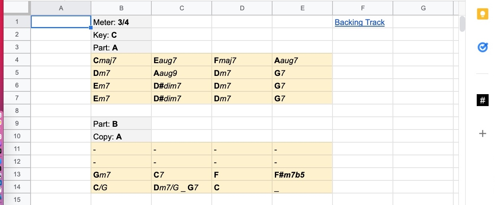

# How to use it

- Install the add-on in Google Sheets. An black icon with a `#` symbol will show up the right sidebar.
- Type chord symbols into the spreadsheet.
  - Each occupied cell represent 1 measure.
  - In addition to chords, you can type `_` to indicate spacing within the measure.
  - A cell with just `_` means that there are no chord changes in that measure.

- Press the black `#` icon to open the add-on, which will format the chords and add a link to the backing track for the tune.
  - You will need to press the "Format" button to refresh whenever there are new changes.
- You can configure the tune; e.g. specifying "Key: D" means the key signature will be D major. Other configurations include
  - Key (default to C)
  - Meter (default to 4/4)
  - Tempo (default to 180 8-th notes per minute)
  - Swing (default to Straight; other options include light, medium and hard).
  - Part (used for naming the part)
  - Copy (specify the part you want to copy, and then type `-` in a cell to use the same chord as the original part).
